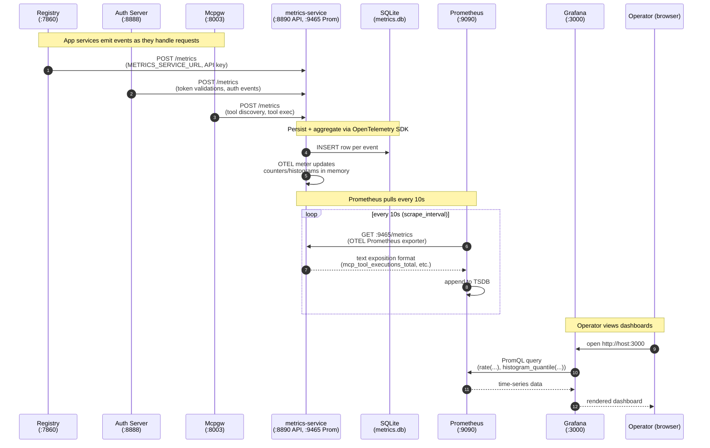
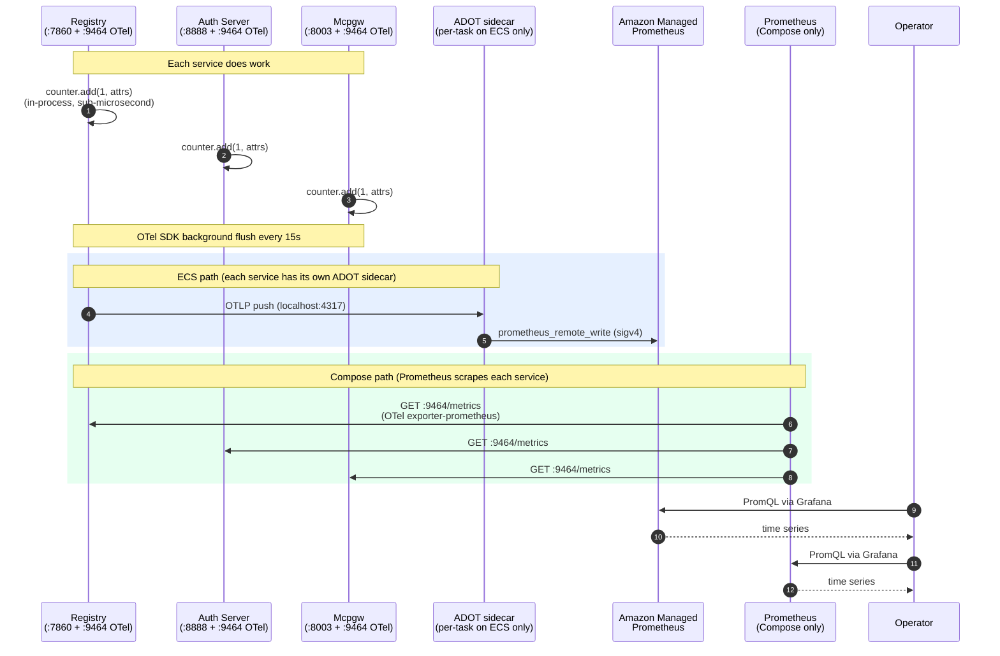

# MCP Gateway Metrics Architecture

A comprehensive observability system for monitoring authentication, tool discovery, and execution across the MCP Gateway ecosystem.

## Overview

The metrics system collects, processes, and visualizes telemetry data from all MCP Gateway components. It provides real-time insights into system performance, user behavior, and service health.

### Key Capabilities

- **Real-time Monitoring**: Sub-second metric collection and export
- **Flexible Integration**: Native support for Prometheus, Grafana, and OpenTelemetry Collector
- **Historical Analysis**: SQLite storage with configurable retention policies
- **Secure & Scalable**: API key authentication with rate limiting
- **Multiple Export Paths**: Direct Prometheus scraping or OTLP export to any observability platform

> **Migration in progress (issue #1122)**: as of 1.25.0, registry/auth-server/mcpgw emit metrics natively via the OpenTelemetry SDK, in-process. The legacy HTTP POST path to `metrics-service:8890` is preserved behind the `METRICS_LEGACY_HTTP_POST=true` flag for one release and removed entirely in 1.26.0. See the "Native OTel Emission (Post-1.25.0)" section below for the new architecture; the diagram below describes the legacy path.

## High-Level Architecture

### End-to-End Sequence (Docker Compose)

The diagram below shows the complete flow from a service emitting an event to an operator viewing it in Grafana. ECS deployments swap Prometheus/Grafana for Amazon Managed Prometheus (AMP) via an ADOT collector sidecar; the producer side (services posting to metrics-service) is identical.



### Component View

```
┌─────────────────────────────────────────────────────────────────┐
│                     Your MCP Services                           │
│                                                                 │
│  ┌───────────────┐  ┌───────────────┐  ┌──────────────────┐  │
│  │ Auth Server   │  │ Registry      │  │  MCP Servers     │  │
│  │ (middleware)  │  │ (middleware)  │  │  (client lib)    │  │
│  └───────┬───────┘  └───────┬───────┘  └────────┬─────────┘  │
│          │                   │                    │             │
│          └───────────────────┴────────────────────┘             │
└──────────────────────────────┬──────────────────────────────────┘
                               │
                    HTTP POST /metrics
                    X-API-Key: <service-key>
                               │
         ┌─────────────────────▼────────────────────┐
         │   Metrics Collection Service             │
         │   (FastAPI + SQLite + OpenTelemetry)    │
         │                                          │
         │   • API Key Authentication               │
         │   • Rate Limiting (1000 req/min)        │
         │   • Request Validation                  │
         │   • Buffered Processing (5s flush)      │
         └────────────┬───────────────┬─────────────┘
                      │               │
         ┌────────────▼──┐      ┌────▼─────────────────────────┐
         │  SQLite DB    │      │  OpenTelemetry Exporters     │
         │               │      │                              │
         │  • Raw metrics│      │  ┌────────────────────────┐ │
         │  • Specialized│      │  │  Prometheus Exporter   │ │
         │    tables     │      │  │  Port: 9465           │ │
         │  • Historical │      │  │  /metrics              │ │
         │    analysis   │      │  └──────────┬─────────────┘ │
         │  • 90 day     │      │             │               │
         │    retention  │      │  ┌──────────▼─────────────┐ │
         └───────────────┘      │  │  OTLP Exporter         │ │
                                │  │  (Optional)            │ │
                                │  │  http://collector:4318 │ │
                                │  └──────────┬─────────────┘ │
                                └─────────────┼───────────────┘
                                              │
                     ┌────────────────────────┴────────────────────────┐
                     │                                                 │
         ┌───────────▼──────────┐                        ┌────────────▼─────────────┐
         │  Grafana             │                        │  OTEL Collector          │
         │  Port: 3000          │                        │  (Optional)              │
         │                      │                        │                          │
         │  • Prometheus queries│                        │  Forwards to:            │
         │  • Pre-built         │                        │  • Datadog               │
         │    dashboards        │                        │  • New Relic             │
         │  • Real-time alerts  │                        │  • Honeycomb             │
         └──────────────────────┘                        │  • Jaeger                │
                                                         │  • Any OTLP-compatible   │
                                                         └──────────────────────────┘
```

## Native OTel Emission (Post-1.25.0)

In 1.25.0+ the application services emit metrics directly through the OpenTelemetry SDK in-process. The metrics-service container is deprecated and removed in 1.26.0.



### What changed compared to the legacy path

| Aspect | Legacy (pre-1.25.0) | Native OTel (1.25.0+) |
|--------|---------------------|------------------------|
| Emission shape | HTTP POST to `metrics-service:8890` per event | In-process `Counter.add(value, attrs)` |
| Per-emission latency | ~5-10 ms (network + serialize) | sub-microsecond (memory write) |
| Auth surface | 6 API keys for 3 services | none (in-process) |
| ECS topology | Centralized metrics-service ECS task with ADOT sidecar | Per-service ADOT sidecar in each task |
| EKS support | None (no metrics-service Helm chart) | Native (registry/auth-server/mcpgw expose `:9464`, NetworkPolicy gates scrape) |
| In-process counters | Invisible everywhere (`prometheus_client.Counter` in process memory) | Exposed via the same OTel pipeline |
| Cardinality risk | High (`user_hash`, `query` text, etc. as labels) | Bounded (pruned to safe attribute set) |

### How to opt in to the legacy path during the transition

For one release (1.25.0), operators on Compose who need the legacy `metrics-service` path active for verification can set:

```bash
METRICS_LEGACY_HTTP_POST=true
```

This causes the services to emit metrics via BOTH paths simultaneously: the new OTel emission AND the old HTTP POST. The `metrics_emission_path_total{path}` counter lets operators verify both are active. The flag and the entire `metrics-service` container are removed in 1.26.0.

### Where in-process counters now live

Each in-process counter (e.g. `nginx_config_writes_total`, `peer_sync_failures_total`, `m2m_orphan_cleanups_total`, `mcp_registry_cloud_detection_total`, the four logout counters, etc.) was previously declared with `prometheus_client.Counter` and never exposed. As of 1.25.0 they are declared in `registry/observability/meters.py` (and `auth_server/observability/meters.py`) using OTel `Counter` instruments wrapped in compatibility adapters that preserve the legacy `.labels(...).inc()` API.

This means EKS deployments now see ~19 counters that were previously invisible there.

## How It Works

### 1. Services Emit Metrics

Your services automatically collect metrics using middleware or client libraries:

**Example: Auth Server tracks authentication events**
```
When: User authenticates to access a tool
Collected: Success/failure, duration, method (JWT/OAuth), user hash, server name
Sent to: http://metrics-service:8890/metrics
```

**Example: Registry tracks tool discovery**
```
When: Semantic search for tools
Collected: Query text, results count, embedding time, search time
Sent to: http://metrics-service:8890/metrics
```

### 2. Metrics Service Processes Data

The centralized service receives, validates, and stores metrics:

- **Authentication**: SHA256-hashed API keys per service
- **Rate Limiting**: Token bucket algorithm (1000 req/min default)
- **Validation**: Schema validation with detailed error reporting
- **Buffering**: In-memory buffer with 5-second flush interval
- **Storage**: Dual-path to SQLite and OpenTelemetry

### 3. Data Export Options

**Option A: Direct Prometheus Scraping (Default)**
```
Prometheus scrapes → metrics-service:9465/metrics
Grafana queries → Prometheus
```

**Option B: OpenTelemetry Collector Pipeline**
```
Metrics Service → OTLP export → OTEL Collector → Your observability platform
                                                  (Datadog, New Relic, etc.)
```

**Option C: Hybrid Approach**
```
Metrics Service → Both Prometheus + OTLP simultaneously
                  (Real-time Grafana + Long-term storage in vendor platform)
```

## Metric Types

### Authentication Metrics
Tracks all authentication requests across services:

- **Dimensions**: success, method (jwt/oauth/noauth), server, user_hash
- **Measurements**: request count, duration
- **Use Cases**: Success rates, auth performance, user activity patterns

### Tool Execution Metrics
Tracks MCP protocol method calls:

- **Dimensions**: method (initialize/tools/list/tools/call), tool_name, client_name, success
- **Measurements**: request count, duration, input/output sizes
- **Use Cases**: Tool popularity, client usage, performance analysis

### Discovery Metrics
Tracks semantic search operations:

- **Dimensions**: query text, results count, top_k/top_n parameters
- **Measurements**: embedding time, FAISS search time, total duration
- **Use Cases**: Search performance optimization, query pattern analysis

### Protocol Latency Metrics
Measures time between protocol steps:

- **Flow Steps**:
  - initialize → tools/list (discovery latency)
  - tools/list → tools/call (selection latency)
  - initialize → tools/call (full flow latency)
- **Use Cases**: User experience optimization, bottleneck identification

## Database Schema

### Specialized Tables

**metrics** - Universal metrics table with JSON dimensions/metadata

**auth_metrics** - Fast queries for authentication analysis
- Indexed on: timestamp, success, user_hash

**tool_metrics** - Tool usage patterns and performance
- Indexed on: timestamp, tool_name, client_name, method

**discovery_metrics** - Search performance and patterns
- Indexed on: timestamp, results_count

**api_keys** - Service authentication
- SHA256 hashed keys with per-service rate limits

All tables include automatic retention cleanup (90 days default).

## OpenTelemetry Integration

### Instruments

The service creates standard OTEL instruments:

**Counters** (cumulative totals):
- `mcp_auth_requests_total` - Authentication events
- `mcp_tool_executions_total` - Tool calls
- `mcp_tool_discovery_total` - Discovery requests
- `mcp_health_checks_total` - Health check operations

**Histograms** (duration distributions):
- `mcp_auth_request_duration_seconds` - Auth latency
- `mcp_tool_execution_duration_seconds` - Tool latency
- `mcp_tool_discovery_duration_seconds` - Discovery query latency
- `mcp_protocol_latency_seconds` - Protocol flow timing
- `mcp_health_check_duration_seconds` - Health check latency

### Export Configuration

**Environment Variables:**
```bash
# Prometheus export (enabled by default)
OTEL_PROMETHEUS_ENABLED=true
OTEL_PROMETHEUS_PORT=9465

# OTLP export (optional, for external platforms)
OTEL_OTLP_ENDPOINT=http://otel-collector:4318
```

### Using OTEL Collector

To send metrics to Datadog, New Relic, or other platforms:

1. **Deploy OTEL Collector** with appropriate exporters:
```yaml
receivers:
  otlp:
    protocols:
      http:
        endpoint: 0.0.0.0:4318

exporters:
  datadog:
    api:
      key: ${DD_API_KEY}
  
  otlp/newrelic:
    endpoint: otlp.nr-data.net:4317
    headers:
      api-key: ${NEW_RELIC_LICENSE_KEY}

service:
  pipelines:
    metrics:
      receivers: [otlp]
      exporters: [datadog, otlp/newrelic]
```

2. **Configure metrics service** to export to collector:
```bash
OTEL_OTLP_ENDPOINT=http://otel-collector:4318
```

3. **Metrics flow automatically** from service → collector → your platform

### Direct OTLP Push Export (Simplified Setup)

For simpler deployments, the metrics service can push OTLP metrics directly to any observability platform that supports OTLP HTTP ingestion **without requiring an intermediate OTEL Collector**. This is the easiest way to integrate with commercial observability platforms.

**Supported Platforms:**
- Datadog (US1, US3, US5, EU1, AP1, GOV)
- New Relic
- Honeycomb
- Grafana Cloud
- Any OTLP-compatible endpoint

**Configuration:**

Set these environment variables to enable direct OTLP push:

```bash
# Required: OTLP endpoint URL
OTEL_OTLP_ENDPOINT=https://otlp.datadoghq.com

# Required: Authentication headers (API keys, tokens)
OTEL_EXPORTER_OTLP_HEADERS=dd-api-key=YOUR_DATADOG_API_KEY

# Optional: Export interval (default: 30000ms = 30 seconds)
OTEL_OTLP_EXPORT_INTERVAL_MS=30000

# Optional: Metric temporality (Datadog requires 'delta', most others use 'cumulative')
OTEL_EXPORTER_OTLP_METRICS_TEMPORALITY_PREFERENCE=delta
```

**Platform-Specific Examples:**

| Platform | Endpoint | Headers | Temporality |
|----------|----------|---------|-------------|
| Datadog US1 | `https://otlp.datadoghq.com` | `dd-api-key=YOUR_KEY` | `delta` |
| Datadog EU1 | `https://otlp.datadoghq.eu` | `dd-api-key=YOUR_KEY` | `delta` |
| New Relic | `https://otlp.nr-data.net` | `api-key=YOUR_LICENSE_KEY` | `cumulative` |
| Honeycomb | `https://api.honeycomb.io` | `x-honeycomb-team=YOUR_API_KEY` | `cumulative` |
| Grafana Cloud | `https://otlp-gateway-{region}.grafana.net/otlp` | `Authorization=Basic {base64}` | `cumulative` |

**Docker Compose Setup:**

Add to your `.env` file:

```bash
# Datadog example
OTEL_OTLP_ENDPOINT=https://otlp.datadoghq.com
OTEL_EXPORTER_OTLP_HEADERS=dd-api-key=YOUR_DATADOG_API_KEY
OTEL_EXPORTER_OTLP_METRICS_TEMPORALITY_PREFERENCE=delta
OTEL_OTLP_EXPORT_INTERVAL_MS=30000
```

Then start the metrics service:

```bash
docker-compose up -d metrics-service
```

The metrics service will automatically start pushing metrics to your configured endpoint every 30 seconds (or your configured interval).

**Terraform/ECS Deployment:**

For AWS ECS deployments, add these variables to your `terraform.tfvars`:

```hcl
# Datadog example
otel_otlp_endpoint = "https://otlp.datadoghq.com"
otel_exporter_otlp_headers = "dd-api-key=YOUR_DATADOG_API_KEY"  # Stored in AWS Secrets Manager
otel_exporter_otlp_metrics_temporality_preference = "delta"
otel_otlp_export_interval_ms = "30000"
```

For security, `OTEL_EXPORTER_OTLP_HEADERS` is stored in AWS Secrets Manager and not exposed in the ECS task definition plaintext.

**Verification:**

1. Check metrics service logs for OTLP export confirmation:
```
INFO: OTLP metrics exporter enabled for https://otlp.datadoghq.com (interval: 30000ms)
```

2. Within 2 minutes, you should see all 9 MCP Gateway metrics appearing in your observability platform:
   - 4 counters: `mcp_auth_requests_total`, `mcp_tool_executions_total`, `mcp_tool_discovery_total`, `mcp_health_checks_total`
   - 5 histograms: `mcp_auth_request_duration_seconds`, `mcp_tool_execution_duration_seconds`, `mcp_tool_discovery_duration_seconds`, `mcp_protocol_latency_seconds`, `mcp_health_check_duration_seconds`

3. All metric dimensions (service, method, tool_name, success, etc.) will appear as tags/labels in your platform

**Benefits of Direct Push:**

- ✅ **No OTEL Collector required** - Simpler architecture, fewer moving parts
- ✅ **Lower latency** - Metrics go directly from service to platform
- ✅ **Easier debugging** - Fewer components in the pipeline
- ✅ **Lower operational overhead** - No collector to manage, scale, or monitor
- ✅ **Secure by default** - API keys stored in Secrets Manager on ECS
- ✅ **Works alongside Prometheus** - Both exporters run simultaneously if needed

**When to Use Direct Push vs OTEL Collector:**

| Use Direct Push When | Use OTEL Collector When |
|-----------------------|--------------------------|
| Single observability platform | Multiple downstream platforms |
| Standard OTLP endpoint | Custom metric transformations needed |
| Simplicity is priority | Advanced filtering/sampling required |
| Platform-native OTLP support | Legacy/proprietary protocols |

**Note:** Direct OTLP push and Prometheus export can run simultaneously. This allows you to use Grafana for real-time monitoring while also sending metrics to a commercial platform for long-term storage and advanced analytics.

## Grafana Dashboards

Pre-built dashboard: **MCP Analytics Comprehensive**

### Key Panels

**Real-time Protocol Activity**
- Shows rate of initialize, tools/list, tools/call operations
- Visualizes the MCP protocol flow in real-time

**Authentication Flow Analysis**
- Success vs failure rates over time
- Auth method distribution (JWT, OAuth, NoAuth)

**Authentication Success Rate**
- Single stat with color thresholds (red < 85%, orange 85-95%, green > 95%)

**Tool Execution Latency**
- P50, P95, P99 percentiles for performance analysis

**Top Tools by Usage**
- Most frequently called tools across all servers

**Protocol Flow Latency**
- Time between protocol steps (initialize → list → call)
- Helps identify user experience bottlenecks

**Dashboard Features:**
- Auto-refresh: 30 seconds
- Time range: Last 1 hour (configurable)
- Variables: Filter by service, server, method

## Getting Started

### Quick Setup

1. **Start the metrics service:**
```bash
docker-compose up -d metrics-service metrics-db grafana
```

2. **Generate API keys for your services:**
```bash
docker-compose exec metrics-service python create_api_key.py
```

3. **Configure your services with API keys:**
```bash
export METRICS_SERVICE_URL=http://metrics-service:8890
export METRICS_API_KEY=<generated-key>
```

4. **Access Grafana:**
```
http://localhost:3000
Default credentials: admin/admin
```

### Integrating Your Service

**Option 1: Use provided middleware (FastAPI/Python)**
```python
from auth_server.metrics_middleware import add_auth_metrics_middleware

app = FastAPI()
add_auth_metrics_middleware(app, service_name="my-service")
```

**Option 2: Send metrics directly via HTTP:**
```python
import httpx

await httpx.post(
    "http://metrics-service:8890/metrics",
    json={
        "service": "my-service",
        "version": "1.0.0",
        "metrics": [{
            "type": "auth_request",
            "value": 1.0,
            "duration_ms": 45.2,
            "dimensions": {"success": True, "method": "jwt"}
        }]
    },
    headers={"X-API-Key": api_key}
)
```

## Configuration

### Metrics Service

```bash
SQLITE_DB_PATH=/var/lib/sqlite/metrics.db
METRICS_SERVICE_PORT=8890
METRICS_RATE_LIMIT=1000                # Requests per minute per API key
METRICS_RETENTION_DAYS=90              # Auto-cleanup after 90 days
```

### OpenTelemetry

```bash
OTEL_SERVICE_NAME=mcp-metrics-service
OTEL_PROMETHEUS_ENABLED=true
OTEL_PROMETHEUS_PORT=9465
OTEL_OTLP_ENDPOINT=                    # Optional: http://otel-collector:4318
```

### Per-Service API Keys

```bash
METRICS_API_KEY_AUTH=<secret-key-1>
METRICS_API_KEY_REGISTRY=<secret-key-2>
METRICS_API_KEY_MYSERVICE=<secret-key-3>
```

The service automatically discovers `METRICS_API_KEY_*` environment variables and creates corresponding API keys.

## Use Cases

### Performance Monitoring
- Track P95/P99 latency for authentication and tool execution
- Identify slow tools or services
- Monitor protocol flow timing to optimize user experience

### Usage Analytics
- Most popular tools across your MCP ecosystem
- Client application distribution (Claude Desktop, custom clients)
- User activity patterns (hashed for privacy)

### Operational Alerts
- Authentication failure spikes
- Service availability issues
- Rate limit exhaustion
- Database growth anomalies

### Capacity Planning
- Request rate trends over time
- Resource utilization patterns
- Growth projection from historical data

## Best Practices

### Security
- Never log API keys in plaintext
- Use separate API keys per service for isolation
- Rotate keys periodically
- Monitor for unusual rate limit patterns

### Performance
- Services emit metrics asynchronously (fire-and-forget)
- Metrics collection adds < 5ms overhead per request
- Buffer size and flush interval tunable for high-volume deployments

### Data Retention
- Default 90 days for raw metrics
- Configure longer retention for aggregated metrics
- Use OTLP export for long-term storage in external platforms

### Observability
- Start with Prometheus + Grafana for simplicity
- Add OTEL Collector when integrating with existing observability stack
- Use hybrid approach for best of both worlds

## Troubleshooting

**Metrics not appearing in Grafana?**
- Check Prometheus is scraping metrics-service:9465
- Verify API key in service configuration
- Check metrics service logs for validation errors

**Rate limit errors?**
- Increase `METRICS_RATE_LIMIT` environment variable
- Check rate limit status: `GET /rate-limit` endpoint

**High database growth?**
- Verify retention policies are active: `GET /admin/retention/policies`
- Manually trigger cleanup: `POST /admin/retention/cleanup`
- Adjust retention days for high-volume tables

## Additional Resources

- **API Reference**: `metrics-service/docs/api-reference.md`
- **Data Retention**: `metrics-service/docs/data-retention.md`
- **Database Schema**: `metrics-service/docs/database-schema.md`
- **Deployment Guide**: `metrics-service/docs/deployment.md`